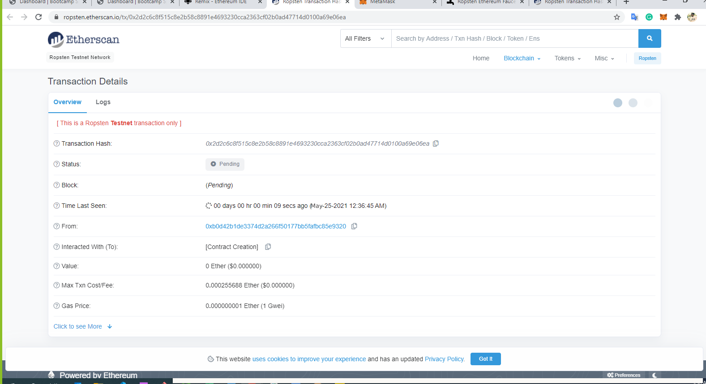

# Looks like we've made our first contract!

Smart contracts to automate finances

## Background
Your new startup has created its own Ethereum-compatible blockchain to help connect financial institutions, and the team wants to build smart contracts to automate some company finances to make everyone's lives easier, increase transparency, and to make accounting and auditing practically automatic.
Fortunately, you've been learning how to program smart contracts with Solidity! What you will be doing this assignment is creating 3 ProfitSplitter contracts. These contracts will do several things:

Pay your associate-level employees quickly and easily.

## Instructions
- Level One is an AssociateProfitSplitter contract. This will accept ether into the contract, and divide it evenly among associate-level employees. This will allow the human resources department to pay employees quickly and efficiently.

Distribute profits to different tiers of employees.

Distribute company shares for employees in a "deferred equity incentive plan" automatically.

## Contracts
- First Contract
  - AssociateProfitSplitter This contract accepts Ether into the contract and divide the Ether evenly among the recipient associate level employees. This will increase the efficiency of human resource departmnet as well as minimize the human effort.

- This contract was deployed and tested on Ropsten Test Network.

## Testing of Network

## Resources
Building the next financial revolution isn't easy, but we need your help. Don't be intimidated by the semicolons!

There are lots of great resources to learn Solidity. Remember, you are helping push the very edge of this space forward, so don't feel discouraged if you get stuck! In fact, be proud that you are taking on such a challenge!

For some succinct and straightforward code snips, check out Solidity By Example

For a more extensive list of awesome Solidity resources, check out Awesome Solidity

Another tutorial is available at EthereumDev.io

If you enjoy building games, here's an excellent tutorial called CryptoZombies

contract address : 0xB0d42B1dE3374d2A266f50177bb5FaFBc85E9320
